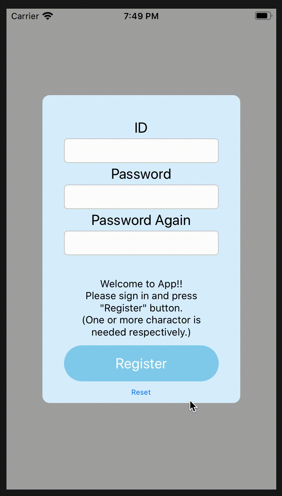

## アプリとサーバーの通信と、ログインの練習をします
(ログイン部分はまだサーバーとの通信してません。端末内に保存します。)

#### アプリ体験
 - UserDefaultsを使ったログイン画面でログイン(ユーザ登録も)
 - Ajaxサーバーからログを受信する(Ajax画面)
 - WebSocketからログを受信する(WebSocket画面)

  

### SwiftとNode.jsでアプリとサーバーの通信を表現します

### 使用するフレームワーク
(Ajax画面)
 - Ajax
 - SwiftyJSON
 - Alamofire

(WebSocket画面)
 - SocketIO

### プロジェクト詳細
 - サーバーをJavaScriptで作成し、JSONまたは単純にログを送信する
 - SwiftでiOSアプリを作成し、サーバーからデータを受け取って表示する

#### 動かし方
①アプリを起動しログインする

②```node ファイル名.js``` コマンドでローカルにサーバーを立ち上げる

③アプリ内でサーバーと接続するボタンを押下する
→画面が更新されていればオッケーです。

### ログイン画面


### Ajaxの方
 

### Socketの方

