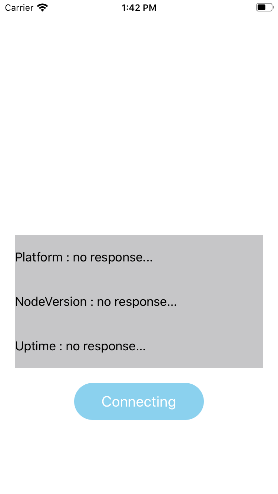

### SwiftとNode.jsでアプリとサーバーの通信を表現します

### 使用するフレームワーク
 - Ajax
 - SwiftyJSON
 - Alamofire

### やり方
①JSONを提供するサーバーをJavaScriptで作成する

②SwiftでiOSアプリを作成する

③```node ファイル名.js``` コマンドでローカルにサーバーを立ち上げる

④アプリ側でそのサーバーのURLにアクセスし、JSONを受け取る
(AlamofireはサーバーURLにアクセスするとき、SwiftyJSONはJSONファイルを受け取った後の処理に使うと思ってる)


