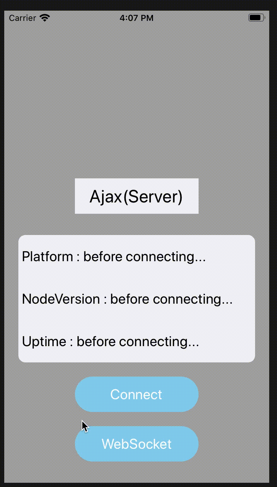
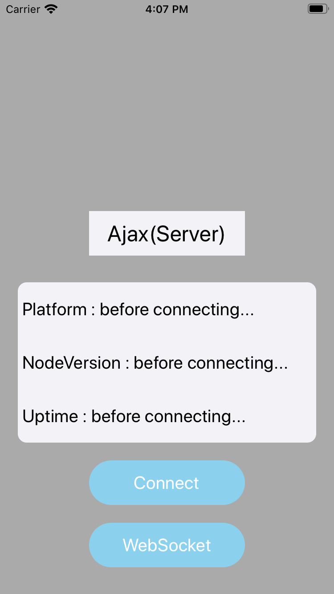

## アプリとサーバーの通信の練習をします
ログイン処理のところは未実装…
#### アプリ体験
 - UserDefaultsを使ったログイン画面でログイン(ユーザ登録も)
 - Ajaxサーバーからログを受信する(画面１)
 - WebSocketからログを受信する(画面２)

 

### SwiftとNode.jsでアプリとサーバーの通信を表現します

### 使用するフレームワーク
 - Ajax
 - SwiftyJSON
 - Alamofire

### やり方
①JSONを提供するサーバーをJavaScriptで作成する

②SwiftでiOSアプリを作成する

③```node ファイル名.js``` コマンドでローカルにサーバーを立ち上げる

④アプリ側でそのサーバーのURLにアクセスし、JSONを受け取る
(AlamofireはサーバーURLにアクセスするとき、SwiftyJSONはJSONファイルを受け取った後の処理に使うと思ってる)

 

サーバーを立ち上げ、接続をするとuptimeが更新されていくのが分かります。
uptimeはサーバーの起動時間を表すので、適切に通信ができていることが分かりますね。

